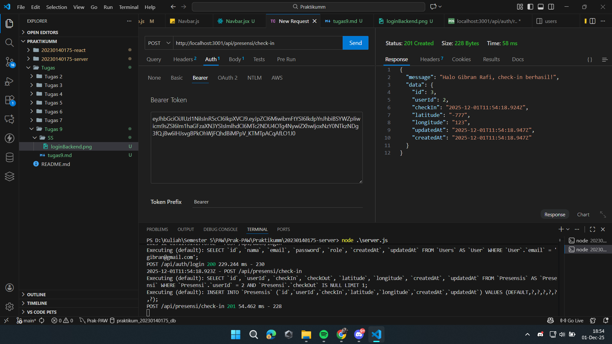
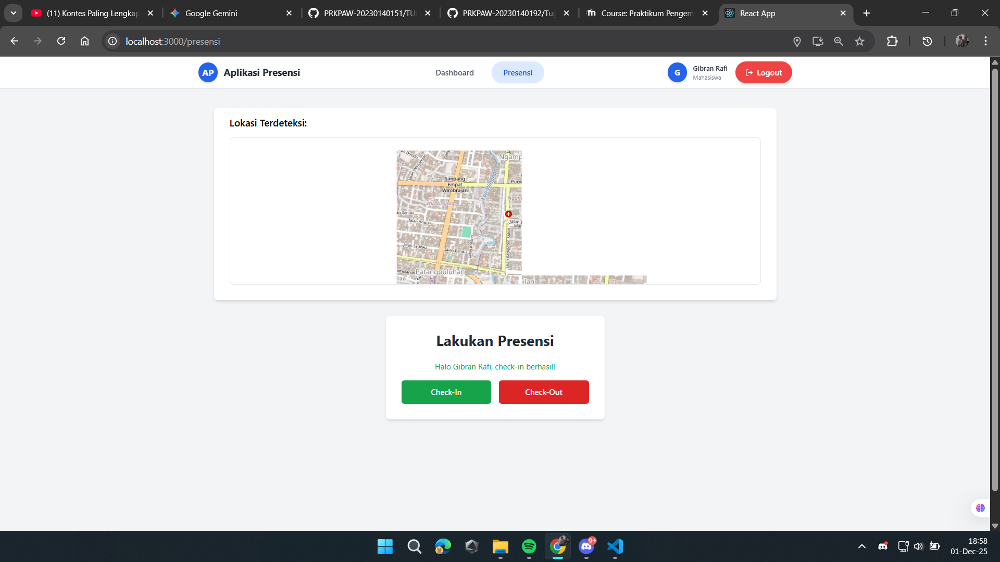
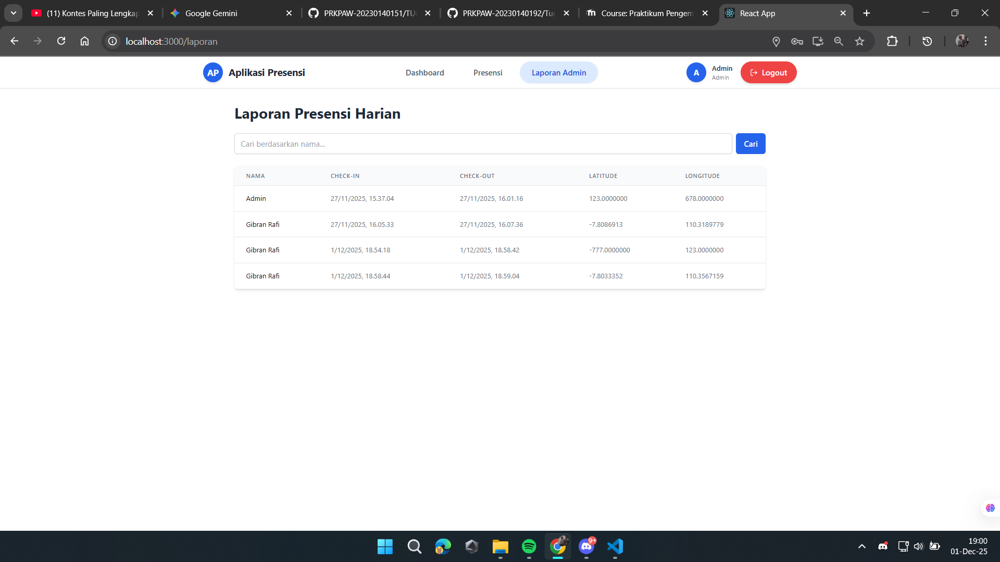
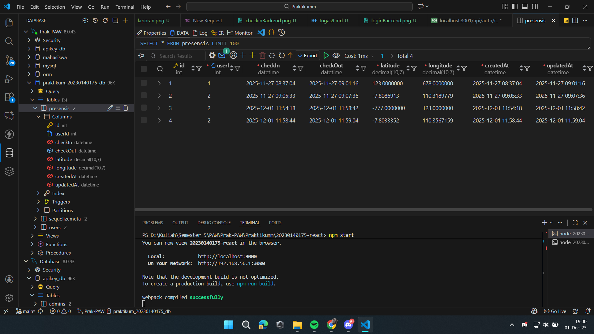

# Tugas 9

**Nama:** Gibran Rafi Pratama  
**NIM:** 20230140175  
**Kelas:** D

---
| Keterangan | Screenshot |
| :---         |     :---:      |
| Endpoint presensi/check-in dengan menggunakan bearer token dan body latitude, longitude |  |
| Check-in berhasil |  |
| Check-out berhasil |  |
| Tampilan halaman report yg berisi data presensi dari semua user |  |
| Screenshot tabel presensi di database |  |
